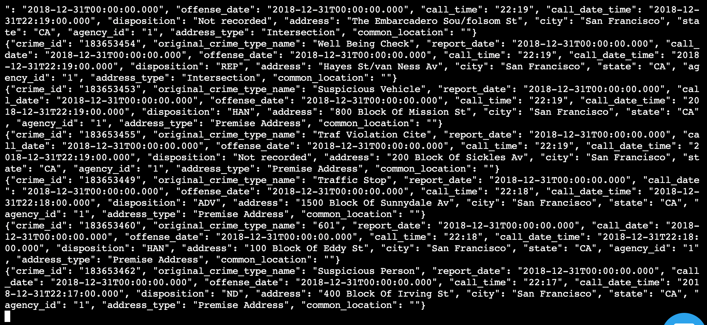
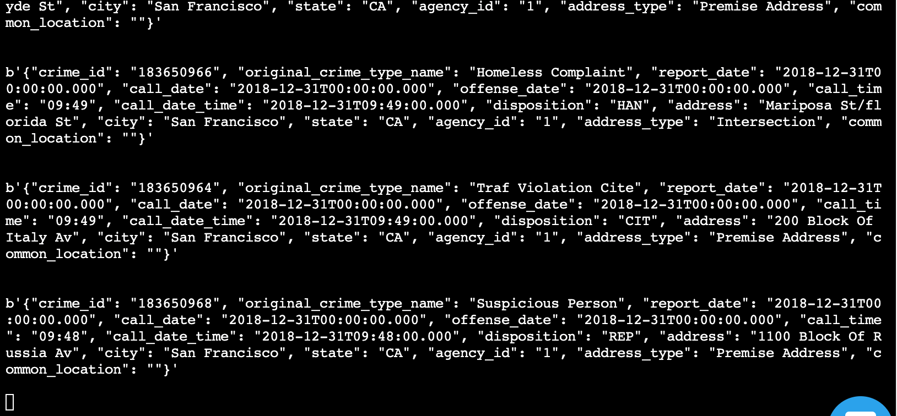
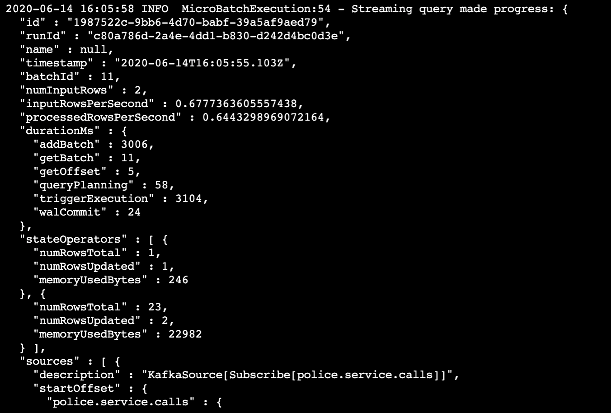
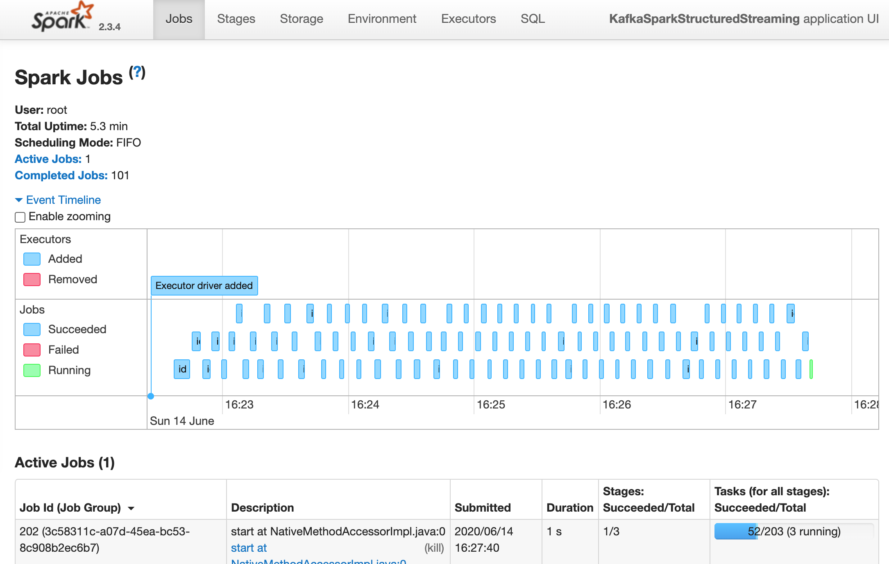

# **SF Crime Data with Kafka and Spark streaming**
### Udacity Data Streaming Nanodegree

#### Alistair Waddell
#### 14.06.2020

Here's my notes for project 2 in the Udactiy Data Streaming Nanodegree, I did the project in the workspace.

Project steps:

1. Install the packages you need for this project by running
```
	./start.sh
```

2. Edit the settings for the zookeeper.properties & server.properties files located in the config folder

3. Open two new terminal windows, and start the Zookeeper and Kafka servers (initialising them with the zookeeper.properties & server.properties files):
```
  /usr/bin/zookeeper-server-start config/zookeeper.properties
```
```
  /usr/bin/kafka-server-start config/server.properties
```		

4. Complete the kafka_server & producer_server python files

5. Run the Python Kafka server:
```
  python kafka_server.py
```
6. Check that it's running with the Kafka consumer console, run this in a new terminal:
```
  kafka-console-consumer --bootstrap-server localhost:9093 --topic police.service.calls --from-beginning
```
Here's a screenshot of how it looked for me:


7. Create a Kafka consumer which subscribes to the police.service.calls topic, in a new consumer_server.py python script.

8. Run your consumer to check that it's working:
```
  python consumer_server.py
```
Mine looked like this:



9. Complete the tasks in the data_stream.py file

10. Run the data_stream code with the command:
```
spark-submit --packages org.apache.spark:spark-sql-kafka-0-10_2.11:2.3.4 --master local[*] data_stream.py
```
Here's a progress report from mine:

And a screenshot of the Spark UI:


## Questions

*How did changing values on the SparkSession property parameters affect the throughput and latency of the data?*

Playing with the parameters affected the streaming performance, and the way I judged this was by observing 'processedRowsPerSecond' in the console progress report.

*What were the 2-3 most efficient SparkSession property key/value pairs? Through testing multiple variations on values, how can you tell these were the most optimal?*

The workspace is limited in power, and I chose to stick to varying the 'maxOffsetsPerTrigger' and 'maxRatePerPartition' parameters. I started with 200 for each (as suggested in the code), and through trial and error found that lower, equal values of these 2 parameters worked well (from watching the 'processedRowsPerSecond' metric in the progress report). In the end I found these values worked very well:

maxRatePerPartition:10

maxOffsetsPerTrigger:10
